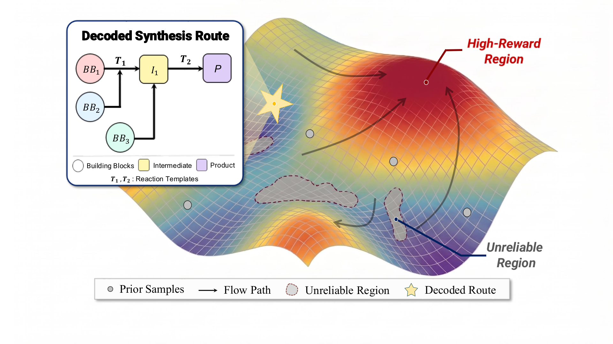

<h1 align="center">Navigating Synthesizable Chemical Space with Reward-Guided Flow Matching</h1>

<p align="center">
  
</p>

A Transformer route autoencoder embeds each synthesis route as a latent code; a conditional flow-matching model is pre-trained over that space and fine-tuned online against a property oracle, transporting latents toward high-reward, synthesizable molecules.

---

## Pipeline at a Glance

| Phase | Stage | Script | Output |
|:-----:|:------|:-------|:-------|
| **0** | Environment | — | conda env |
| **1** | Reaction compatibility | `build_compatibility.py` | `compatibility_matrix.pkl` |
| **2** | Route enumeration | `enumerate_routes.py` | `routes_{train,val,test}.pkl` |
| **3** | Route autoencoder | `train_autoencoder.py` / `eval_autoencoder.py` | `autoencoder_best.pt` |
| **4a** | Flow pre-training (CFM) | `4a_train_flow.py` / `4a_eval_flow.py` | `flow_pretrain_best.pt` |
| **4b** | Online fine-tuning (ORW-CFM-W2) | `4b_train_flow.py` / `4b_eval_flow.py` | optimized molecules |

---

## Repository Structure

```
.
├── routeflow/          # Core library
│   ├── chem/           #   Building blocks, templates, reaction executor
│   ├── data/           #   Route representation, enumeration, datasets
│   ├── models/         #   Encoder, decoder, autoencoder, velocity net
│   ├── flow/           #   Flow matching (CFM) + ORW-CFM-W2 fine-tuning
│   ├── inference/      #   ODE integration / latent optimization
│   └── oracle.py       #   Property-oracle interface (TDC)
├── scripts/            # Pipeline entry points (phases 1–4b)
├── configs/            # ae_1x256.yaml — reference config (latent 1×256)
├── data/raw/           # Inputs: building-block library + reaction templates
└── requirements.txt
```

---

## Installation

```bash
conda create -n routeflow python=3.11 -y
conda activate routeflow

# PyTorch — adjust the CUDA build to your system
pip install torch torchvision torchaudio --index-url https://download.pytorch.org/whl/cu121

conda install -c conda-forge rdkit -y
pip install numpy scipy scikit-learn pandas PyTDC pyyaml tqdm matplotlib
```

> **Notes.** SA score uses RDKit's bundled `Contrib/SA_Score/sascorer.py` (included in the conda-forge build; loaded automatically). TDC downloads each oracle on first use, so Phase 4b needs network access; docking tasks also require a docking backend (e.g. AutoDock Vina via TDC).

Run all commands from the repository root with it on `PYTHONPATH`:

```bash
export PYTHONPATH="$PWD"
```

---

## Data

Inputs live in `data/raw/`; derived artifacts are written to `data/processed/` (auto-created). Paths, model sizes, and hyperparameters are set in [`configs/ae_1x256.yaml`](configs/ae_1x256.yaml).

| Input file | Description |
|:-----|:------------|
| `Enamine_Building_Blocks_US.csv` | Purchasable building-block library |
| `rxn_templates.txt` | Reaction templates (SMARTS) |

---

## Running the Pipeline

Run in order from the repository root. (Each phase maps to one cluster job in the original setup.)

**Phase 1 — Reaction compatibility.**
```bash
python scripts/build_compatibility.py --config configs/ae_1x256.yaml
```

**Phase 2 — Route enumeration.** Enumerate routes, filter the val/test splits, and build the hard test set used by the Phase 3 evaluation.
```bash
python scripts/enumerate_routes.py --config configs/ae_1x256.yaml
# Filtered val / test_easy (SA < 2.5, QED > 0.5)
python scripts/enumerate_routes.py --config configs/ae_1x256.yaml --val_test_only_filtered
# Hard test set (SA > 3.5, QED > 0.5)
python scripts/enumerate_routes.py --config configs/ae_1x256.yaml --hard_test_only
```

**Phase 3 — Route autoencoder.** Train (multi-GPU via `torchrun`; set `--nproc_per_node` to your GPU count), then evaluate.
```bash
torchrun --nproc_per_node=8 scripts/train_autoencoder.py --config configs/ae_1x256.yaml
python scripts/eval_autoencoder.py --config configs/ae_1x256.yaml --split test_easy
python scripts/eval_autoencoder.py --config configs/ae_1x256.yaml --split test_hard
```

**Phase 4a — Flow pre-training (CFM).** Pre-train the latent flow (zero oracle), then sample.
```bash
python scripts/4a_train_flow.py --config configs/ae_1x256.yaml
python scripts/4a_eval_flow.py  --config configs/ae_1x256.yaml --num_samples 1000
```

**Phase 4b — Online fine-tuning (ORW-CFM-W2).** Optimize against an oracle (any `--property` from the table below), then evaluate.
```bash
python scripts/4b_train_flow.py --config configs/ae_1x256.yaml --property GSK3B
python scripts/4b_eval_flow.py  --config configs/ae_1x256.yaml --property GSK3B
```

---

## Optimization Tasks

Pass any task to `--property`. All oracles are provided by Therapeutics Data Commons (TDC); docking receptors are fetched automatically.

| Task type | Tasks | Budget |
|:----------|:------|:------:|
| **Bioactivity optimization** | `JNK3`, `DRD2`, `GSK3B` | 10 000 |
| **Name-based optimization** | `amlodipine_mpo`, `fexofenadine_mpo`, `osimertinib_mpo`, `perindopril_mpo`, `ranolazine_mpo`, `sitagliptin_mpo`, `zaleplon_mpo`, `median_1`, `median_2`, `celecoxib_rediscovery` | 10 000 |
| **Docking-based optimization** | `DRD3` (3PBL), `EGFR` (2RGP), `A2AR` (3EML) | 1 000 |

---

## Outputs

| Phase | Artifacts |
|:-----:|:----------|
| 1 | `data/processed/compatibility_matrix.pkl` |
| 2 | `data/processed/routes_{train,val,test_easy,test_hard}.pkl` |
| 3 | Autoencoder checkpoint in `checkpoints/` + reconstruction metrics |
| 4a | Pre-trained flow checkpoint in `checkpoints/` + prior-sample metrics |
| 4b | Optimized molecules + Top-K results in `results/` |
